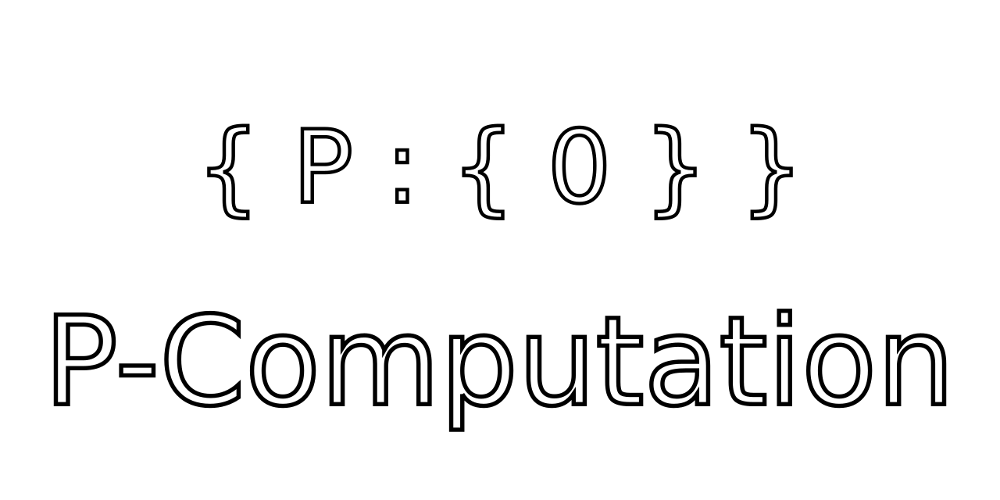

<h1 align="center">

  

</h1>

[About](#About)&nbsp;&nbsp;&nbsp;|&nbsp;&nbsp;&nbsp;[Installation](#Installation-)&nbsp;&nbsp;&nbsp;|&nbsp;&nbsp;&nbsp;[Features](#Features)&nbsp;&nbsp;&nbsp;|&nbsp;&nbsp;&nbsp;[Wiki][wiki]&nbsp;&nbsp;&nbsp;|&nbsp;&nbsp;&nbsp;[Release][release]&nbsp;&nbsp;&nbsp;|&nbsp;&nbsp;&nbsp;[Contributing](CONTRIBUTING.md)&nbsp;&nbsp;&nbsp;|&nbsp;&nbsp;&nbsp;[License](LICENSE)

## Contents

* [**About**](#About)
* [**Features**](#Features)
* [**Installation**](#Installation-)
* [**Licensing**](#License-)

## About

<table>
<tr>
<td>
  A C++ based transpiler for the P-computation programming language ({P}); additionally including documentation, specification, and theoretical discussions.
</td>
</tr>
</table>

## Features

## Installation 

*P* is currently only available from source via [Bazel][bazel-build] (v 4.0.0) for multi-platform compilation and scaling. The build is configurable with the following flags:

<table>
<tr>
<td>
  Required flags:

  - `--config=(debug|release)`
      - `debug` builds an unoptimized release with all relevant debugging information.
      - `release` builds an optimized release with no debugging information.
  
</td>
</tr>
<tr>
<td>
  Optional flags:

  - `--config=(asan|msan|ubsan|test) <Santizer>` compiles [Google Santizers][santizers] with the static library. This option may overwrite other options on the build. The `Santizer` can be any of `asan`, `msan`, `ubsan`, or `tsan`.

</td>
</tr>
</table>

#### *P* **build** with [Bazel][bazel-build]:

- `bazel build '...' --config=(debug|release) --config(asan|msan|ubsan|tsan)`

The project will be built to `bazel-bin/pcompuation/`.

You may also test the current implementation for your configuration:

#### *P* **test** build with [Bazel][bazel-build]:

- `bazel test '...' --config=(debug|release) --config=(asan|msan|ubsan|tsan)`

The latest test evaluation is continuously integrated on [Buildkite][buildkite]. To build specific projects (compiler, docs, etc) specify '...' to target directory.

Refer to the platform specific instructions if necessary.

## License 

[MIT](LICENSE) © Robbie VanDerzee

  Built with :heart: by Robbie VanDerzee

<!--
Website References
-->
[bazel-build]:https://github.com/bazelbuild/bazel
[buildkite]:https://buildkite.com/Andromeda
[santizers]:https://github.com/google/sanitizers

<!--
Wiki references
-->

<!--
Link References
-->
[release]:https://github.com/robbie-vanderzee/pcompuation/releases/ "Latest Release (external link) ➶"
[wiki]:https://github.com/robbie-vanderzee/pcompuation/wiki "Wiki (external link) ➶"

[badge-license]:https://img.shields.io/github/license/robbie-vanderzee/pcompuation?color=blue&style=for-the-badge
[badge-stars]:https://img.shields.io/github/stars/robbie-vanderzee/pcomputation?style=for-the-badge
[badge-archlinux]:https://img.shields.io/badge/-Archlinux-blue?style=for-the-badge&logo=arch-linux&logoColor=white